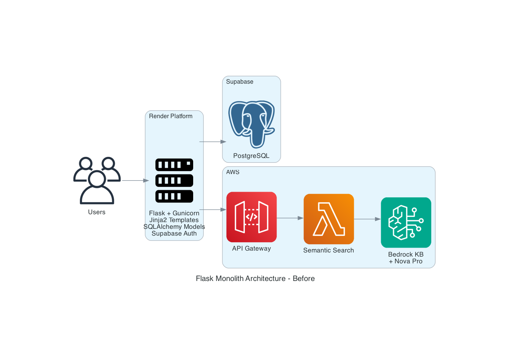
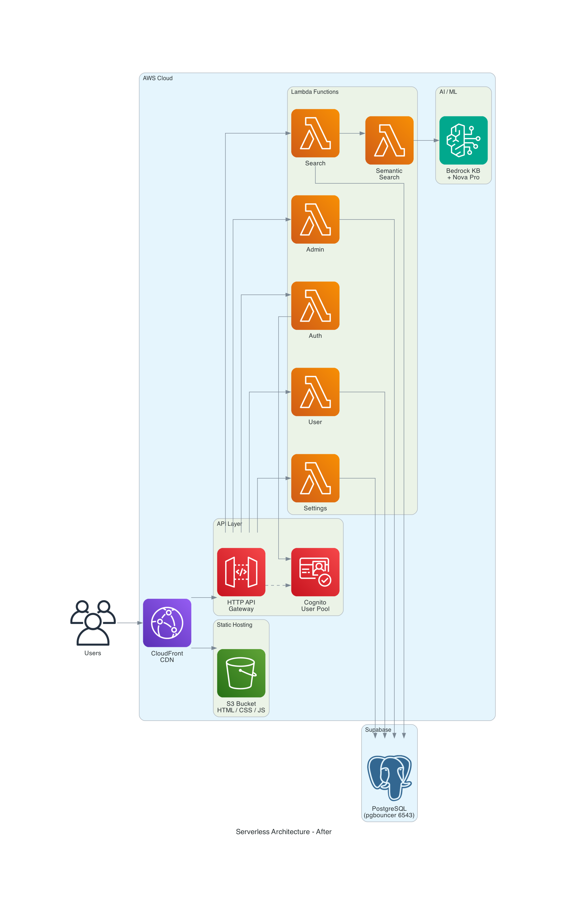
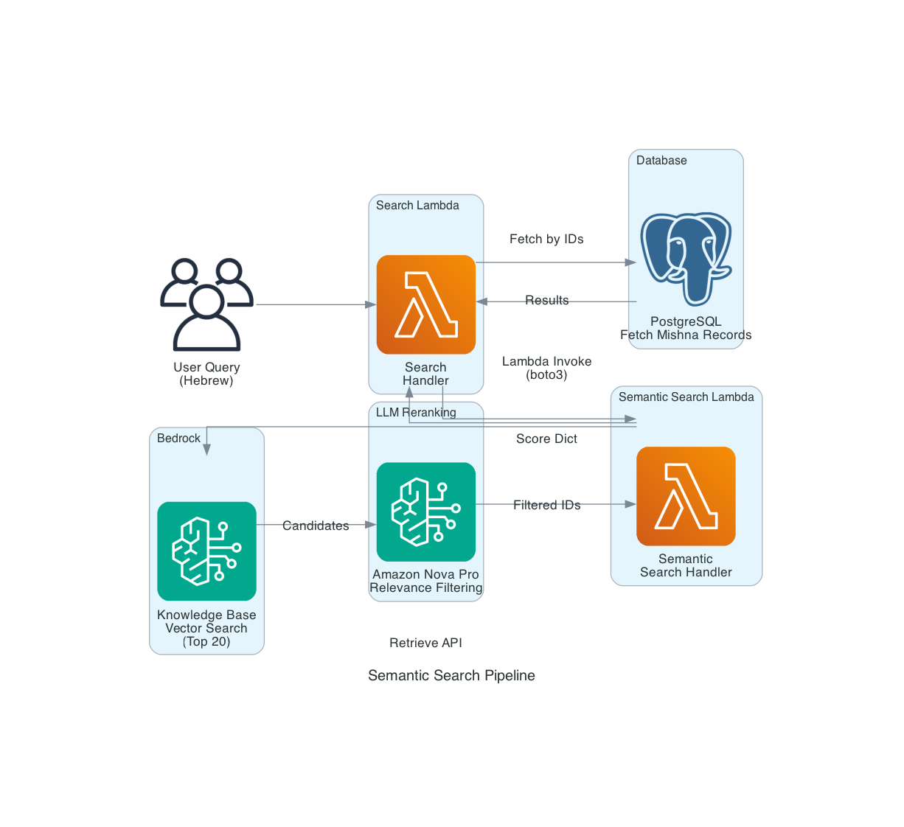
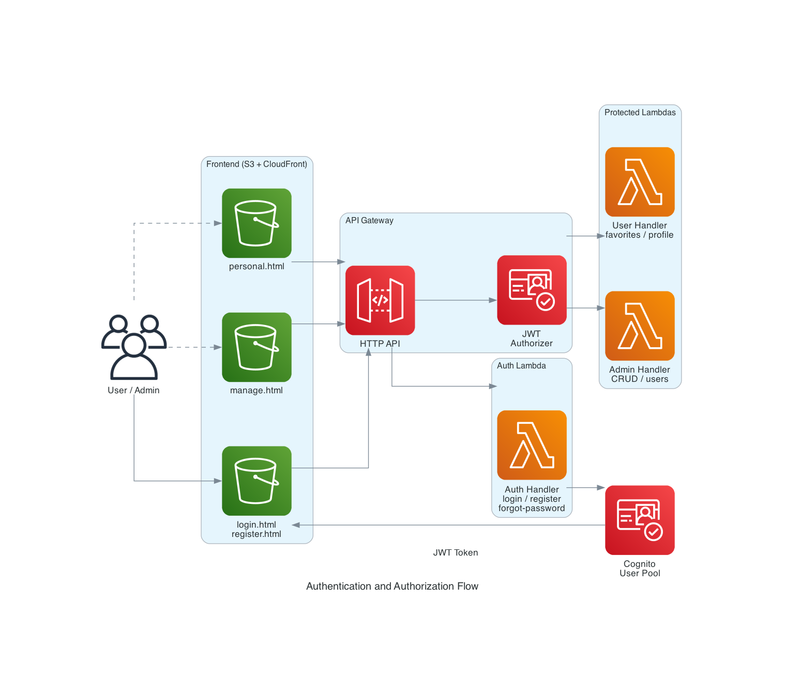

# From Flask Monolith to AWS Serverless: Migrating a Hebrew Search Application

*How I decomposed a Flask/Gunicorn web app into Lambda functions, replaced Jinja2 with Alpine.js, and added AI-powered semantic search — all while keeping the same database and zero downtime.*

---

## Introduction

[Pirkei Avot Finder](https://pirkei-avot.online) is a Hebrew-language web application for searching and studying Mishnayot (teachings) from Pirkei Avot (Ethics of the Fathers). It supports multi-modal search: chapter/mishna navigation, exact text search, tag-based filtering, and AI-powered semantic search that understands the *meaning* of Hebrew queries.

The application started as a Flask monolith running on Render. It worked, but it had scaling limitations, cold start issues on the free tier, and a tightly coupled architecture that made it hard to evolve. This article walks through the full transformation to a serverless AWS architecture using Lambda, API Gateway, S3, CloudFront, Cognito, and Bedrock.

---

## The Original Architecture

The monolith was a standard Flask/Gunicorn application:



**Stack:**
- **Runtime**: Flask + Gunicorn on Render (free tier)
- **Templates**: Jinja2 server-side rendering
- **Database**: PostgreSQL on Supabase
- **Auth**: Supabase Auth (email/password for admin)
- **ORM**: Flask-SQLAlchemy
- **Semantic Search**: A separate AWS Lambda behind API Gateway, calling Bedrock Knowledge Base

**Pain points:**
- Render's free tier spun down after inactivity, causing 30+ second cold starts
- The monolith handled everything: routing, templating, database queries, auth, and API calls to the semantic search Lambda
- Scaling meant scaling the entire app, even if only search traffic spiked
- Jinja2 templates were tightly coupled to Flask — no CDN caching for HTML
- The semantic search was already on AWS, creating a split architecture

---

## The Target: Fully Serverless on AWS

The goal was to move everything to AWS while preserving the existing database on Supabase and maintaining identical user-facing behavior.



**New stack:**

| Layer | Technology |
|---|---|
| Frontend | Static HTML + Alpine.js 3.x + Tailwind CSS 2.x, served from S3 |
| CDN | CloudFront with custom domain (`pirkei-avot.online`) and ACM certificate |
| API | API Gateway HTTP API with Cognito JWT authorizer |
| Compute | 6 AWS Lambda functions (Python 3.12) |
| Database | PostgreSQL on Supabase (unchanged, via pgbouncer pooler on port 6543) |
| Auth | Amazon Cognito User Pool (email/password, self-registration) |
| AI Search | Bedrock Knowledge Base + Amazon Nova Pro LLM reranking |
| IaC | AWS SAM (`template.yaml`) |

---

## Architecture Decisions

### Why Not Just Containerize?

The simplest migration would have been to put the Flask app in a Docker container on ECS or App Runner. I chose Lambda instead for several reasons:

1. **Cost**: The app has bursty traffic — mostly idle with occasional search spikes. Lambda's pay-per-invocation model is significantly cheaper than an always-on container.
2. **Independent scaling**: Search, admin, and auth have very different traffic patterns. Separate Lambda functions scale independently.
3. **Smaller blast radius**: A bug in the admin handler doesn't affect search. Each function has its own IAM permissions, memory allocation, and timeout.
4. **The semantic search was already on Lambda**: Half the architecture was already serverless. Moving the rest eliminated the split.

### Why Keep Supabase PostgreSQL?

The database had no issues. Supabase provides a managed PostgreSQL instance with a built-in pgbouncer connection pooler on port 6543. This pooler is critical for Lambda — each Lambda container holds exactly one database connection (`pool_size=1`), and the pooler multiplexes hundreds of concurrent Lambda connections over a smaller number of actual database connections.

Migrating to RDS would have added cost and complexity with no benefit. The data stays where it is.

### Why Alpine.js Instead of React/Vue?

The original Jinja2 templates were relatively simple — search forms, result cards, tag selection, and an admin panel. Alpine.js provides just enough reactivity for this use case:

- Inline in HTML (no build step, no bundler, no node_modules)
- Tiny footprint (~15KB)
- Declarative syntax that maps naturally to the existing template structure
- Works perfectly with Tailwind CSS via CDN

The frontend is truly static — no server-side rendering, no build pipeline. Just HTML files served from S3.

---

## The Migration: Step by Step

### Step 1: Shared Lambda Layer

The first task was extracting shared code that all Lambda functions would need. In the monolith, Flask-SQLAlchemy provided the ORM. In Lambda, there's no Flask — so the models needed to be ported to plain SQLAlchemy with `declarative_base()`.

The shared layer (`layers/shared/`) contains:

```
layers/shared/
├── models.py          # SQLAlchemy models (Mishna, Tag, Category, SiteSetting, UserFavorite, AiSearchLog)
├── db.py              # Engine + session factory (module-level initialization)
├── response.py        # API Gateway response helpers (success_response, error_response, serialize_mishna)
├── text_utils.py      # Hebrew niqqud removal (U+0591–U+05C7)
├── constants.py       # ALLOWED_CHAPTERS mapping (6 chapters, Hebrew letter keys)
└── requirements.txt   # sqlalchemy, psycopg2-binary
```

The key change in `db.py` is module-level initialization. The database engine is created *outside* the handler function, so it persists across warm Lambda invocations:

```python
import os
from sqlalchemy import create_engine
from sqlalchemy.orm import sessionmaker

DATABASE_URL = os.environ['DATABASE_URL']

engine = create_engine(
    DATABASE_URL,
    pool_size=1,          # One connection per Lambda container
    max_overflow=0,       # Never create extra connections
    pool_pre_ping=True,   # Verify connection before use
    pool_recycle=300,      # Refresh every 5 minutes
    connect_args={'sslmode': 'require'}
)

Session = sessionmaker(bind=engine)
```

This is a standard Lambda optimization — cold starts create the engine, warm invocations reuse it.

### Step 2: Lambda Function Decomposition

The monolith's routes were split into six Lambda functions by domain:

| Lambda Function | Purpose | Routes | Auth |
|---|---|---|---|
| `pirkei-avot-search` | Public search endpoints | 5 GET routes | None |
| `pirkei-avot-semantic-search` | Bedrock KB + Nova Pro reranking | Direct invoke (no HTTP) | Internal |
| `pirkei-avot-admin` | Content management + user management | 13 routes | Cognito JWT |
| `pirkei-avot-settings` | Site configuration | 2 routes | GET: None, PUT: JWT |
| `pirkei-avot-auth` | Login, register, password reset | 5 POST routes | None |
| `pirkei-avot-user` | Favorites and profile | 5 routes | Cognito JWT |

Each handler follows a consistent pattern:

```python
def handler(event, context):
    path = event.get('rawPath', '')
    method = event.get('requestContext', {}).get('http', {}).get('method', '')
    session = Session()
    try:
        if path == '/api/search/mishna' and method == 'GET':
            return _search_mishna(session, event)
        # ... more routes
        else:
            return error_response('הנתיב המבוקש לא נמצא', 'NOT_FOUND', 404)
    except SQLAlchemyError as e:
        logger.error(f'Database error: {str(e)}', exc_info=True)
        return error_response('אירעה שגיאה בגישה למסד הנתונים', 'INTERNAL_ERROR', 500)
    except Exception as e:
        logger.error(f'Unexpected error: {str(e)}', exc_info=True)
        return error_response('אירעה שגיאה פנימית', 'INTERNAL_ERROR', 500)
    finally:
        session.close()
```

Key principles:
- **Session per invocation**: Created at the start, closed in `finally`
- **Layered error handling**: SQLAlchemy errors caught separately for rollback, generic catch-all for everything else
- **Hebrew error messages**: All user-facing errors are in Hebrew; machine-readable codes (`VALIDATION_ERROR`, `NOT_FOUND`, etc.) are for programmatic handling
- **Internal functions prefixed with `_`**: Route handlers are private, only `handler()` is the entry point

### Step 3: The Semantic Search Pipeline

The most interesting part of the architecture is the semantic search. When a user types a Hebrew query like "מה אומרים על חכמה" (what do they say about wisdom), the system needs to find relevant Mishnayot by *meaning*, not just keyword matching.



The pipeline works in two stages:

**Stage 1 — Vector Search (Bedrock Knowledge Base):**
The Bedrock Knowledge Base contains all 108 Mishnayot indexed as vector embeddings. The query is converted to a vector and the top 20 nearest neighbors are retrieved.

**Stage 2 — LLM Reranking (Amazon Nova Pro):**
Vector search is good but noisy. The 20 candidates are sent to Amazon Nova Pro (via the Converse API) with a prompt asking it to filter for truly relevant results. The LLM understands Hebrew context and returns only the Mishnayot that actually relate to the query.

The search handler invokes the semantic search Lambda directly via `boto3.client('lambda').invoke()` — no HTTP API Gateway in between. This is faster (no HTTP overhead) and simpler (no extra API to manage).

```python
# In search_handler.py
response = lambda_client.invoke(
    FunctionName=os.environ['SEMANTIC_SEARCH_FUNCTION_NAME'],
    InvocationType='RequestResponse',
    Payload=json.dumps({'query': query})
)
result = json.loads(response['Payload'].read())
# result = {'results': {'mishna_42': 0.95, 'mishna_7': 0.87, ...}}
```

The search handler then fetches the actual Mishna records from PostgreSQL, sorted by the relevance scores from the LLM.

### Step 4: Frontend Conversion (Jinja2 → Alpine.js)

Every Jinja2 template was converted to a static HTML file with Alpine.js components. The conversion pattern was consistent:

**Before (Jinja2):**
```html

  <div class="result-card">
    <h3>פרק {{ result.chapter }} • משנה {{ result.mishna }}</h3>
    <p>{{ result.text_pretty }}</p>
  </div>

```

**After (Alpine.js):**
```html
<template x-for="result in results" :key="result.id">
  <div class="result-card">
    <h3 x-text="'פרק ' + result.chapter + ' • משנה ' + result.mishna"></h3>
    <p x-text="result.text_pretty"></p>
  </div>
</template>
```

The main Alpine.js components:

- **`searchApp()`** — Main search state, three search modes, result rendering, favorites toggle
- **`tagSelection()`** — Tag filtering, category grouping, show-more toggles
- **`pirushModal()`** — PDF viewer with Google Docs iframe, loading/retry states
- **`adminApp()`** — Admin panel with tabbed navigation, CRUD forms, user management

API communication uses a simple fetch pattern:

```javascript
async function apiGet(path) {
    const response = await fetch('/api' + path);
    if (response.status === 401) {
        localStorage.removeItem('authToken');
        window.location.href = '/login.html';
        return;
    }
    return response.json();
}
```

### Step 5: Authentication Migration (Supabase Auth → Cognito)

The monolith used Supabase Auth for admin login. The serverless version uses Amazon Cognito with a User Pool configured for email/password authentication.



**The auth flow:**
1. User submits credentials on `login.html`
2. Frontend calls `POST /api/auth/login`
3. Auth Lambda calls Cognito `InitiateAuth` (USER_PASSWORD_AUTH flow)
4. On success, returns JWT ID token with `custom:role` claim
5. Frontend stores token in `localStorage`
6. All protected API calls include `Authorization: Bearer <token>`
7. API Gateway Cognito authorizer validates JWT before Lambda is invoked

**Role-based access:**
- `custom:role = 'user'` → Can access personal area (favorites, profile)
- `custom:role = 'admin'` → Can access admin panel + user management

The Cognito authorizer runs at the API Gateway level, so invalid tokens never reach Lambda. This is both more secure and more efficient than validating tokens in application code.

### Step 6: Infrastructure as Code (AWS SAM)

The entire infrastructure is defined in a single `template.yaml` file using AWS SAM. This includes:

- 6 Lambda functions with their event mappings
- 1 shared Lambda layer
- API Gateway HTTP API with Cognito authorizer and rate limiting
- Cognito User Pool and Client
- S3 bucket for static hosting
- CloudFront distribution with dual origins (S3 + API Gateway)
- CloudFront Origin Access Identity for S3
- IAM policies for each Lambda function

The deployment is automated with a single script:

```bash
#!/usr/bin/env bash
set -euo pipefail

sam validate --lint          # Validate template
sam build --use-container    # Build in Docker (Python 3.12)
sam deploy                   # Deploy CloudFormation stack
aws s3 sync frontend/ ...   # Sync static files to S3
aws cloudfront create-invalidation ...  # Clear CDN cache
```

The `--use-container` flag is important — it builds Lambda packages inside a Docker container matching the Lambda runtime (Python 3.12), ensuring native dependencies like `psycopg2` are compiled for the correct platform.

---

## CloudFront: The Unified Entry Point

CloudFront serves as the single entry point for both the static frontend and the API. This is achieved with path-based routing:

- **Default behavior** → S3 origin (static HTML, CSS, JS, images)
- **`/api/*` behavior** → API Gateway origin (Lambda functions)

From the user's perspective, everything is served from `https://pirkei-avot.online`. There's no separate API domain, no CORS issues between frontend and backend (same origin), and CloudFront handles HTTPS termination with an ACM certificate.

Static assets get CloudFront's default caching. API responses are configured with a caching-disabled policy so every request hits Lambda.

---

## Database Connection Strategy

Lambda's ephemeral nature creates a unique challenge for database connections. Each Lambda container creates its own connection, and with concurrent invocations, you can quickly exhaust a database's connection limit.

The solution has two parts:

**1. Lambda-side: Minimal pool settings**
```python
engine = create_engine(
    DATABASE_URL,
    pool_size=1,       # One connection per container
    max_overflow=0,    # Never create extras
    pool_pre_ping=True # Verify before use
)
```

**2. Database-side: Supabase pgbouncer pooler (port 6543)**

Supabase provides a built-in pgbouncer connection pooler. Instead of connecting directly to PostgreSQL on port 5432, Lambda connects to the pooler on port 6543. The pooler multiplexes many client connections over fewer actual database connections using transaction-mode pooling.

This means 100 concurrent Lambda containers (100 client connections) might share just 10 actual PostgreSQL connections. The connection string is identical except for the port number.

---

## What Changed, What Didn't

### Changed
- **Runtime**: Flask/Gunicorn → AWS Lambda (Python 3.12)
- **Hosting**: Render → S3 + CloudFront
- **Templates**: Jinja2 → Alpine.js + static HTML
- **Auth**: Supabase Auth → Amazon Cognito
- **ORM**: Flask-SQLAlchemy → plain SQLAlchemy `declarative_base()`
- **Deployment**: Git push to Render → `sam deploy` + S3 sync
- **Semantic search invocation**: HTTP API call → Lambda-to-Lambda invoke

### Didn't Change
- **Database**: Same Supabase PostgreSQL instance, same schema, same data
- **Database models**: Same tables (Mishna, Tag, Category, SiteSetting, mishna_tag)
- **UI/UX**: Same Hebrew RTL layout, gold/dark theme, glassmorphism effects, animations
- **Search behavior**: Same multi-modal search (chapter/mishna, smart, tags, navigate-by-number)
- **Semantic search pipeline**: Same Bedrock KB + Nova Pro reranking logic

---

## Lessons Learned

### 1. Module-level initialization matters

In Lambda, anything initialized outside the handler function persists across warm invocations. The database engine, boto3 clients, and configuration reads should all happen at module level. This turned a ~500ms cold start penalty into a ~50ms warm invocation.

### 2. Connection pooling is non-negotiable

Without Supabase's pgbouncer pooler, the application would have hit connection limits within minutes under moderate load. Every Lambda container holds one connection, and containers can scale to hundreds. The pooler is the safety valve.

### 3. Lambda-to-Lambda invoke beats HTTP for internal calls

The semantic search Lambda is never called by users directly — only by the search handler. Using `boto3.client('lambda').invoke()` instead of an HTTP API Gateway endpoint eliminates HTTP overhead, simplifies IAM (no API key management), and reduces latency.

### 4. Alpine.js is underrated for this use case

For a content-focused application with moderate interactivity, Alpine.js hits a sweet spot. No build step means the frontend is truly static — just HTML files in an S3 bucket. The entire frontend deploys in seconds with `aws s3 sync`.

### 5. SAM makes infrastructure manageable

Having all AWS resources in a single `template.yaml` file means the infrastructure is version-controlled, reviewable, and reproducible. `sam deploy` is incremental — it only updates resources that changed. A Lambda code change deploys in under a minute.

### 6. Two-phase deployment reduces risk

Deploying first to the CloudFront URL (Phase 1) and only connecting the custom domain after verification (Phase 2) meant the existing Render deployment stayed live until the new stack was fully tested. Zero downtime migration.

---

## Cost Comparison

| Component | Render (Before) | AWS Serverless (After) |
|---|---|---|
| Compute | Free tier (with cold starts) or $7/mo | Lambda: ~$0.50/mo (pay per request) |
| Database | Supabase free tier | Supabase free tier (unchanged) |
| CDN | None | CloudFront: ~$1/mo |
| Auth | Supabase Auth (free) | Cognito: free tier (50K MAU) |
| SSL | Render-managed | ACM (free) |
| AI Search | Lambda + Bedrock (~$2/mo) | Same (~$2/mo) |
| **Total** | **$0–$7/mo** | **~$3.50/mo** |

The serverless version costs roughly the same as the paid Render tier, but without cold starts, with independent scaling, and with a CDN in front of everything.

---

## Project Structure (Final)

```
├── template.yaml              # SAM infrastructure (all AWS resources)
├── samconfig.toml             # Deployment config (gitignored)
├── scripts/deploy.sh          # Automated deployment pipeline
├── functions/
│   ├── search/                # Public search (5 endpoints)
│   ├── semantic_search/       # Bedrock KB + Nova Pro reranking
│   ├── admin/                 # Admin CRUD + user management
│   ├── settings/              # Site settings (pirush toggle)
│   ├── auth/                  # Login, register, password reset
│   └── user/                  # Favorites, profile
├── layers/shared/             # Shared Lambda layer
│   ├── models.py              # SQLAlchemy models
│   ├── db.py                  # Database engine + session factory
│   ├── response.py            # API response helpers
│   ├── text_utils.py          # Hebrew text normalization
│   ├── constants.py           # Chapter/mishna mappings
│   └── requirements.txt       # Layer dependencies
├── frontend/                  # Static site (S3 + CloudFront)
│   ├── index.html             # Main search page (Alpine.js)
│   ├── manage.html            # Admin panel
│   ├── login.html             # Login page
│   ├── register.html          # Registration page
│   ├── personal.html          # Personal area (favorites)
│   ├── error.html             # Error page
│   └── static/                # CSS, images, Lottie animations
├── tests/                     # Unit tests (pytest)
└── docs/                      # Deployment guide, dev guide
```

---

## Conclusion

Migrating from a Flask monolith to AWS serverless wasn't just about changing where the code runs. It was a fundamental shift in how the application is structured:

- **Decomposition**: One monolith became six focused Lambda functions with clear boundaries
- **Static frontend**: Server-rendered templates became CDN-cached static files
- **Managed auth**: Custom auth code became a managed Cognito service
- **Infrastructure as code**: Manual Render configuration became a version-controlled SAM template
- **AI integration**: The semantic search pipeline, already on AWS, became a first-class citizen instead of an external API call

The result is an application that scales to zero when idle, handles traffic spikes without intervention, deploys in under two minutes, and costs a few dollars a month to run.

The database didn't move. The UI didn't change. The users didn't notice. That's the best kind of migration.

---

*Built by [Moti Shaul](https://www.linkedin.com/in/moti-shaul). The project is live at [pirkei-avot.online](https://pirkei-avot.online).*
